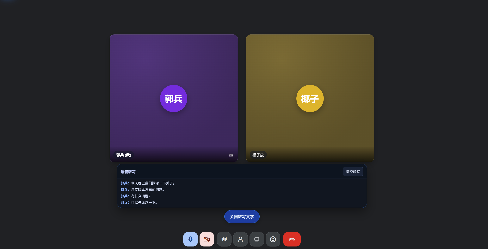
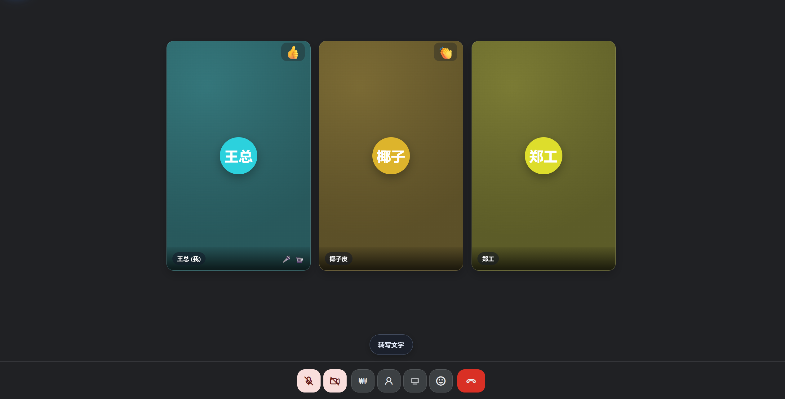
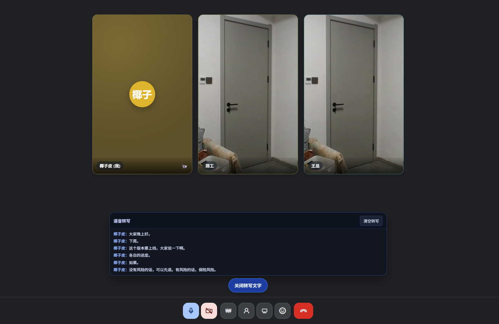
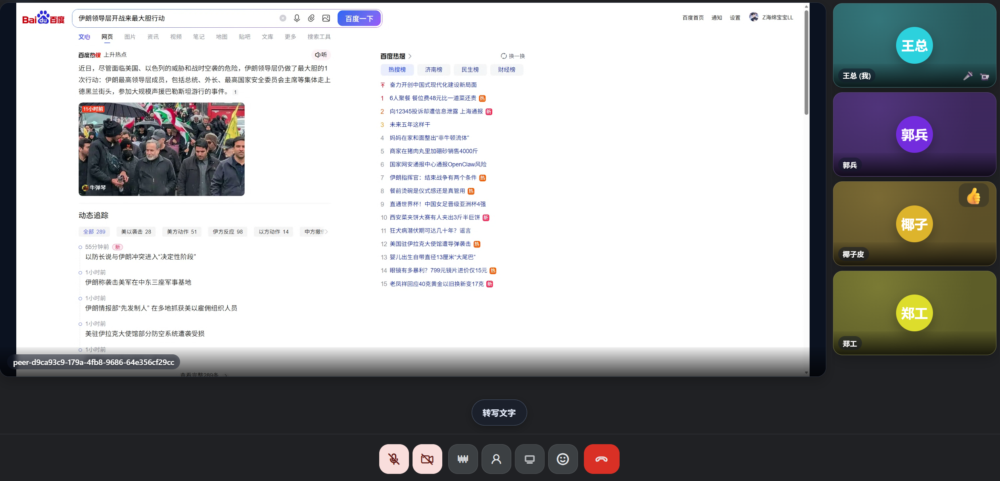
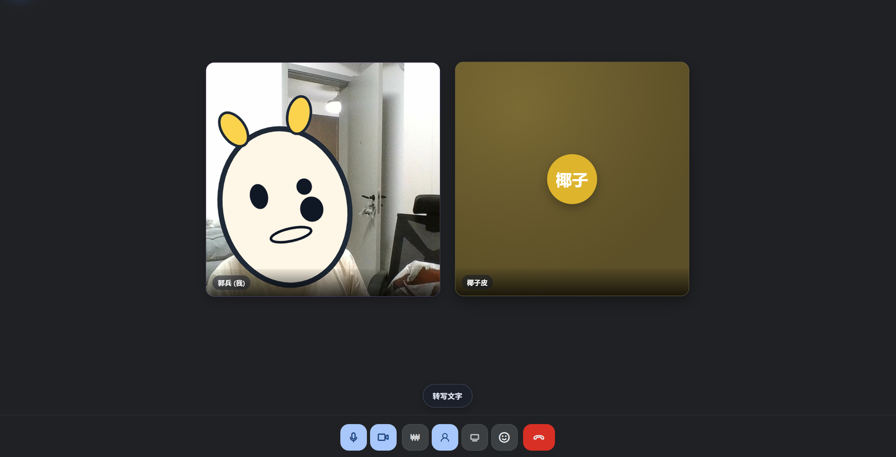
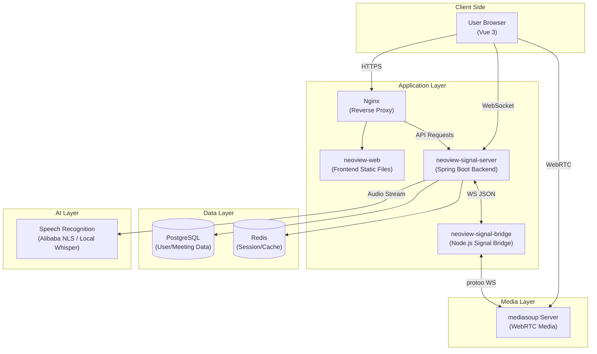
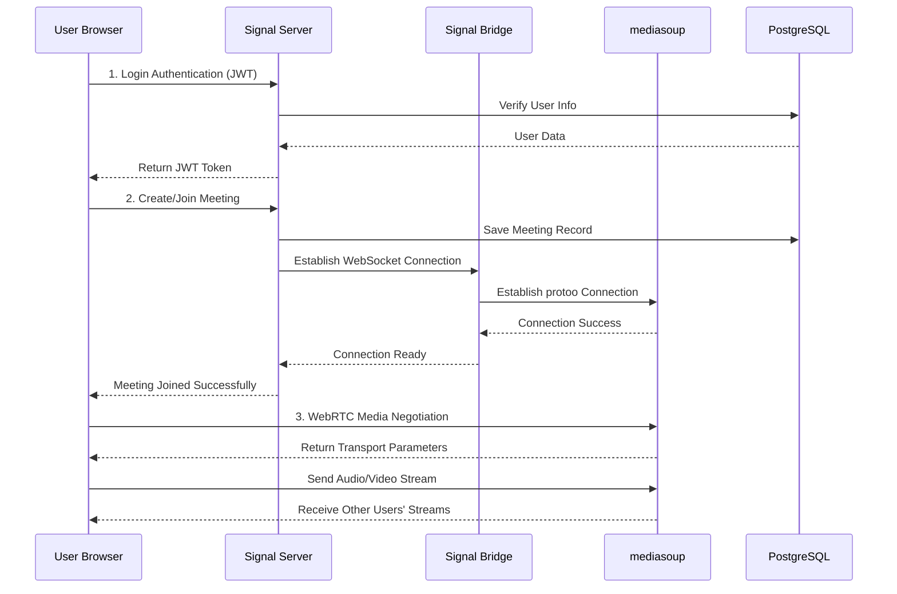
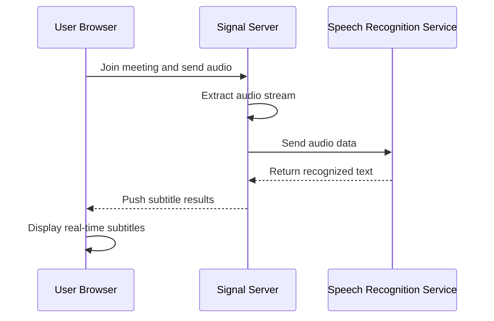

<p align="center">
  
</p>

<h1 align="center">NeoView</h1>

<p align="center">
  <strong>WebRTC Audio/Video Conferencing System Based on mediasoup</strong>
</p>

<p align="center">
  <a href="https://www.meet.neoview.net">Live Demo</a> •
  <a href="#features">Features</a> •
  <a href="#getting-started">Getting Started</a> •
  <a href="#architecture">Architecture</a>
</p>

<p align="center">
  
  
  
  
  
</p>

---

## Introduction

NeoView is an open-source WebRTC audio/video conferencing system built on mediasoup, providing high-quality, low-latency real-time audio/video communication capabilities. It supports multi-party video conferencing, screen sharing, real-time speech recognition, and is suitable for online education, remote work, telemedicine, and other scenarios.

**Live Demo**: [https://www.meet.neoview.net](https://www.meet.neoview.net)

---

## Features

- **Multi-party Video Conferencing** - Support for simultaneous multi-user video calls with adaptive bitrate
- **Screen Sharing** - One-click sharing of screen or application windows
- **Real-time Speech Recognition** - Real-time speech-to-text based on Alibaba Cloud NLS
- **AI Noise Suppression** - Background noise elimination using RNNoise model
- **Responsive Design** - Support for desktop and mobile browsers
- **Secure Authentication** - JWT-based user authentication

---

## Screenshots

<table>
  <tr>
    <td align="center"><b>Meeting 1</b></td>
    <td align="center"><b>Meeting 2</b></td>
    <td align="center"><b>Meeting 3</b></td>
  </tr>
  <tr>
    <td></td>
    <td></td>
    <td></td>
  </tr>
  <tr>
    <td align="center"><b>Screen Sharing</b></td>
    <td align="center"><b>Virtual Avatar</b></td>
    <td></td>
  </tr>
  <tr>
    <td></td>
    <td></td>
    <td></td>
  </tr>
</table>

---

## Architecture

NeoView uses a front-end/back-end separation architecture with three core modules:

### Overall Architecture



### Core Flow Diagrams

#### User Join Meeting Flow



#### Real-time Speech Recognition Flow



### Module Overview

| Module | Tech Stack | Description |
|--------|------------|-------------|
| **neoview-web** | Vue 3 + Vite + mediasoup-client | Frontend application, provides user interface and media handling |
| **neoview-signal-server** | Spring Boot 3.2 + Java 21 | Backend service, user authentication, meeting management, business logic |
| **neoview-signal-bridge** | Node.js + protoo-client | Signal bridging, connects Spring Boot with mediasoup |

---

## Speech Recognition Technology Choice

> **Why Alibaba Cloud NLS?**

The real-time speech recognition (ASR) feature currently uses **Alibaba Cloud NLS**. This is a deliberate technical decision:

### Background

In practice, we found:
- **High GPU cost**: Local ASR deployment requires GPU servers, starting at thousands of yuan/month
- **Maintenance overhead**: Requires dedicated personnel for model updates and service stability
- **Initial scale**: For early-stage open source projects, cloud services offer better cost-effectiveness

### About Local Whisper Solution

If you have **GPU server resources**, you can use **faster-whisper** for completely offline speech recognition. We've reserved the ASR service interface for easy replacement:

```java
// ASR Service Interface
public interface AsrService {
    void startRecognition(String sessionId, AudioStreamListener listener);
    void stopRecognition(String sessionId);
}

// 1. Alibaba Cloud NLS Implementation (Default)
public class AliyunNlsAsrService implements AsrService { ... }

// 2. Local Whisper Implementation (Requires GPU)
public class LocalWhisperAsrService implements AsrService {
    // Use faster-whisper Java bindings
    // Or call Python whisper service via gRPC
}
```

**Recommended Resources:**
- [faster-whisper](https://github.com/SYSTRAN/faster-whisper) - Efficient Whisper implementation
- [whisper-jax](https://github.com/sanchit-gandhi/whisper-jax) - JAX accelerated version

> ⚠️ **Note**: Actual testing shows that running whisper.cpp on CPU, even with the small model, has poor recognition efficiency and high latency. Local Whisper solution is not recommended in non-GPU environments.

---

## Getting Started

### Requirements

- **Java**: JDK 21+
- **Node.js**: 18+
- **PostgreSQL**: 14+
- **Redis**: 6+
- **mediasoup-demo**: Need to deploy mediasoup-demo server

### Environment Variables

#### signal-server (Backend)

```bash
# Database
export DB_HOST=localhost
export DB_PORT=5432
export DB_NAME=neoview
export DB_USERNAME=postgres
export DB_PASSWORD=your_password

# JWT
export JWT_SECRET=your_jwt_secret_key

# Alibaba Cloud NLS (Optional)
export ALIYUN_NLS_ACCESS_KEY_ID=your_access_key_id
export ALIYUN_NLS_ACCESS_KEY_SECRET=your_access_key_secret
export ALIYUN_NLS_APP_KEY=your_app_key
```

#### signal-bridge (Signal Bridge)

```bash
# mediasoup server address
export PROTOO_HOST=your_mediasoup_host
export PROTOO_PORT=4443
export PROTOO_PROTOCOL=wss
```

#### web (Frontend)

```bash
# API endpoint
export VITE_API_BASE=https://your-domain.com
export VITE_WS_URL=wss://your-domain.com/ws/signaling
```

### Start Services

#### 1. Initialize Database

```bash
psql -U postgres -f neoview-signal-server/src/main/resources/db/schema.sql
```

#### 2. Start Backend

```bash
cd neoview-signal-server
./mvnw spring-boot:run
```

#### 3. Start Signal Bridge

```bash
cd neoview-signal-bridge
npm install
npm start
```

#### 4. Start Frontend

```bash
cd neoview-web/web
npm install
npm run dev
```

### Access Application

Open browser and visit `http://localhost:5173`

---

## Deployment

### Prerequisites

> ⚠️ **Important**: This project depends on **mediasoup server**. Please deploy mediasoup-demo first. See [mediasoup documentation](https://mediasoup.org/documentation/)

### Deployment Methods

Manual deployment is currently available. Docker deployment will be provided in future releases.

Production deployment recommendations:
- Use Nginx as reverse proxy
- Configure HTTPS certificate (required by WebRTC)
- Use PostgreSQL master-slave replication
- Redis cluster deployment

---

## Tech Stack

### Frontend

- **Vue 3** - Progressive JavaScript framework
- **Vite** - Next generation frontend build tool
- **mediasoup-client** - WebRTC client library
- **RNNoise** - AI noise suppression

### Backend

- **Spring Boot 3.2** - Java application framework
- **MyBatis-Flex** - ORM framework
- **Spring Security + JWT** - Security authentication
- **PostgreSQL** - Relational database
- **Redis** - Cache database

### Signaling Service

- **Node.js** - Signal bridge runtime
- **protoo-client** - mediasoup signaling protocol client
- **WebSocket** - Real-time bidirectional communication

### Media Services

- **mediasoup** - WebRTC media server
- **Alibaba Cloud NLS** - Real-time speech recognition

---

## Roadmap

> ⭐ Your Stars are our greatest motivation for continuous iteration! With enough attention and support, we will accelerate the implementation of the following plans.

### Feature Roadmap

| Feature | Description | Status |
|---------|-------------|--------|
| 📚 Meeting Knowledge Base | Centralized management and intelligent retrieval of meeting materials | Planned |
| 🤖 AI Assistant | LLM-based intelligent meeting assistant for Q&A and summarization | Planned |
| 📝 Meeting Minutes | Auto-generated meeting minutes with export and sharing support | Planned |
| 🎭 3D Avatar | 3D virtual avatar based on real-time facial capture | Planned |

### Platform Expansion

| Platform | Description | Status |
|----------|-------------|--------|
| 🖥️ Electron Client | Cross-platform desktop client for a more stable local experience | Planned |
| 📱 Android Client | Native Android application | Planned |
| 🍎 iOS Client | Native iOS application | Planned |

---

## License

This project is licensed under the [MIT](LICENSE) License - free for commercial use.

---

## Contact

For questions or suggestions, please contact us via [Gitee Issues](https://gitee.com/your-username/neoview/issues).

---

<p align="center">
  Made with ❤️ by NeoView Team
</p>
