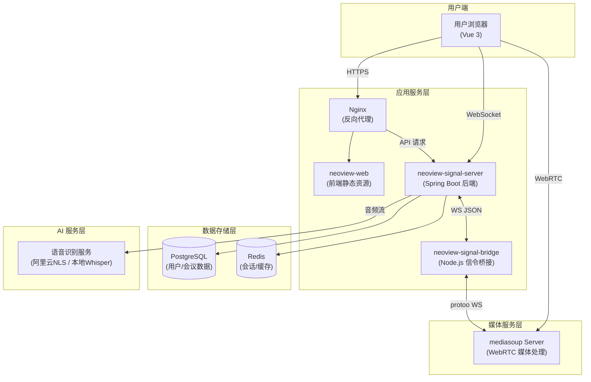
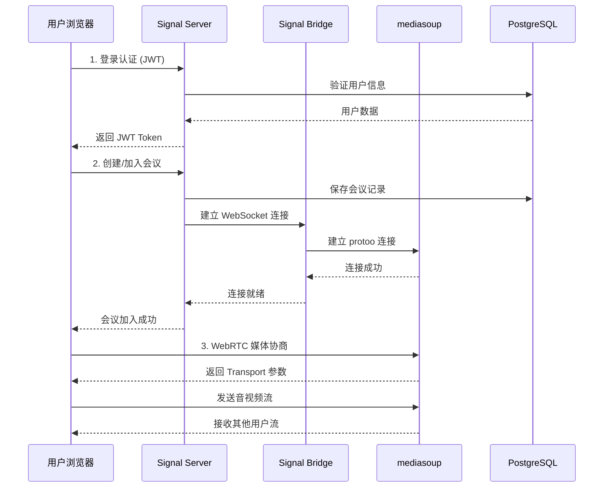
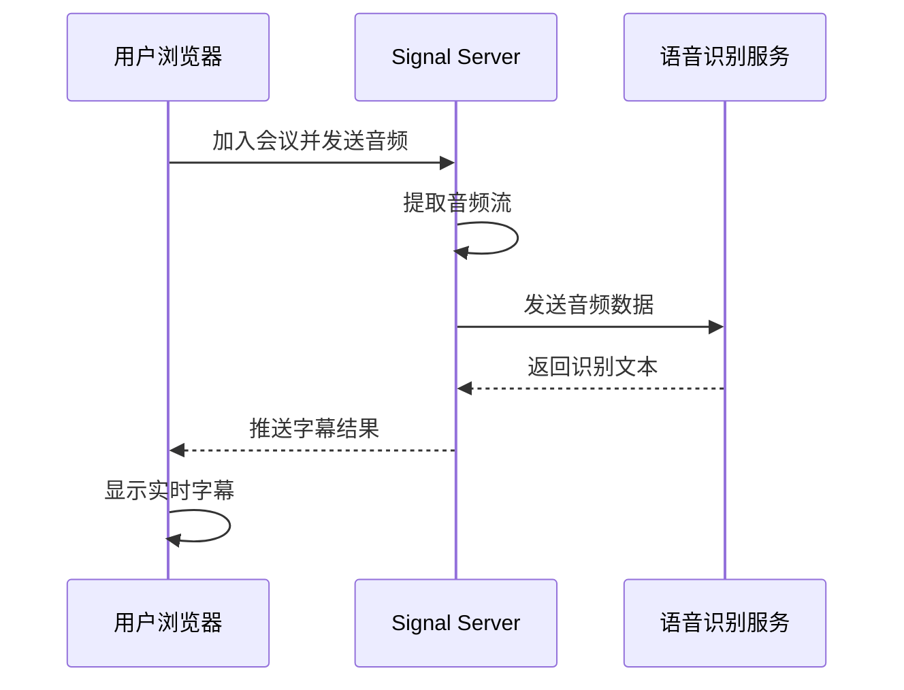

<p align="center">
  <!-- Logo 图片待添加 -->
  <!--  -->
</p>

<h1 align="center">NeoView</h1>

<p align="center">
  <strong>基于 mediasoup 的 WebRTC 音视频会议系统</strong>
</p>

<p align="center">
  <a href="https://www.meet.neoview.net">在线体验</a> •
  <a href="#功能特性">功能特性</a> •
  <a href="#快速开始">快速开始</a> •
  <a href="#项目架构">项目架构</a>
</p>

<p align="center">
  
  
  
  
  
  
</p>

---

## 简介

NeoView 是一个开源的 WebRTC 音视频会议系统，基于 mediasoup 构建，提供高质量、低延迟的实时音视频通信能力。支持多人视频会议、屏幕共享、实时语音识别等功能，适用于在线教育、远程办公、在线医疗等场景。

**体验地址**: [https://www.meet.neoview.net](https://www.meet.neoview.net)

---

## 功能特性

- **多方视频会议** - 支持多人同时视频通话，自适应码率
- **屏幕共享** - 一键共享屏幕或应用窗口
- **实时语音识别** - 基于阿里云 NLS 的实时语音转文字
- **AI 增强降噪** - 使用 RNNoise 模型消除背景噪音
- **响应式设计** - 支持桌面端和移动端浏览器
- **安全的用户认证** - 基于 JWT 的用户身份验证

---

## 截图预览

<table>
  <tr>
    <td align="center"><b>在线会议 1</b></td>
    <td align="center"><b>在线会议 2</b></td>
    <td align="center"><b>在线会议 3</b></td>
  </tr>
  <tr>
    <td></td>
    <td></td>
    <td></td>
  </tr>
  <tr>
    <td align="center"><b>屏幕共享</b></td>
    <td align="center"><b>虚拟头像</b></td>
    <td></td>
  </tr>
  <tr>
    <td></td>
    <td></td>
    <td></td>
  </tr>
</table>

---

## 项目架构

NeoView 采用前后端分离架构，由三个核心模块组成：

### 整体架构图



### 核心流程图

#### 用户加入会议流程



#### 实时语音识别流程



### 模块说明

| 模块 | 技术栈 | 说明 |
|------|--------|------|
| **neoview-web** | Vue 3 + Vite + mediasoup-client | 前端应用，提供用户界面和媒体处理 |
| **neoview-signal-server** | Spring Boot 3.2 + Java 21 | 后端服务，用户认证、会议管理、业务逻辑 |
| **neoview-signal-bridge** | Node.js + protoo-client | 信令桥接，连接 Spring Boot 与 mediasoup |

---

## 语音识别技术选型

> **为什么选择阿里云 NLS？**

本项目的实时语音识别（ASR）功能目前基于 **阿里云 NLS** 实现。这是一个经过深思熟虑的技术选型决策：

### 选型背景

在实际部署中，我们发现：
- **GPU 资源成本高**：部署本地 ASR 服务需要 GPU 服务器，月成本数千元起步
- **维护成本**：需要专人维护模型更新、服务稳定性
- **初期用户规模**：对于开源项目初期，云端服务性价比更高

### 关于本地 Whisper 方案

如果你有 **GPU 服务器资源**，可以使用本地部署的 **faster-whisper** 模型，实现完全离线的语音识别。我们预留了 ASR 服务的接口，可以轻松替换实现：

```java
// ASR 服务接口
public interface AsrService {
    void startRecognition(String sessionId, AudioStreamListener listener);
    void stopRecognition(String sessionId);
}

// 1. 阿里云 NLS 实现 (默认)
public class AliyunNlsAsrService implements AsrService { ... }

// 2. 本地 Whisper 实现 (需要 GPU)
public class LocalWhisperAsrService implements AsrService {
    // 使用 faster-whisper Java 绑定
    // 或通过 gRPC 调用 Python whisper 服务
}
```

**推荐资源：**
- [faster-whisper](https://github.com/SYSTRAN/faster-whisper) - 高效的 Whisper 实现
- [whisper-jax](https://github.com/sanchit-gandhi/whisper-jax) - JAX 加速版本

> ⚠️ **注意**：经实际测试，在 CPU 上运行 whisper.cpp 即使使用 small 模型，识别效率较差且延迟较高，不建议在无 GPU 环境下使用本地 Whisper 方案。

---

## 快速开始

### 环境要求

- **Java**: JDK 21+
- **Node.js**: 18+
- **PostgreSQL**: 14+
- **Redis**: 6+
- **mediasoup-demo**: 需要部署 mediasoup-demo 服务端

### 配置环境变量

#### signal-server (后端服务)

```bash
# 数据库配置
export DB_HOST=localhost
export DB_PORT=5432
export DB_NAME=neoview
export DB_USERNAME=postgres
export DB_PASSWORD=your_password

# JWT 配置
export JWT_SECRET=your_jwt_secret_key

# 阿里云 NLS 语音识别 (可选)
export ALIYUN_NLS_ACCESS_KEY_ID=your_access_key_id
export ALIYUN_NLS_ACCESS_KEY_SECRET=your_access_key_secret
export ALIYUN_NLS_APP_KEY=your_app_key
```

#### signal-bridge (信令桥接)

```bash
# mediasoup 服务地址
export PROTOO_HOST=your_mediasoup_host
export PROTOO_PORT=4443
export PROTOO_PROTOCOL=wss
```

#### web (前端应用)

```bash
# API 地址
export VITE_API_BASE=https://your-domain.com
export VITE_WS_URL=wss://your-domain.com/ws/signaling
```

### 启动服务

#### 1. 启动数据库

```bash
# 初始化数据库
psql -U postgres -f neoview-signal-server/src/main/resources/db/schema.sql
```

#### 2. 启动后端服务

```bash
cd neoview-signal-server
./mvnw spring-boot:run
```

#### 3. 启动信令桥接

```bash
cd neoview-signal-bridge
npm install
npm start
```

#### 4. 启动前端

```bash
cd neoview-web/web
npm install
npm run dev
```

### 访问应用

打开浏览器访问 `http://localhost:5173`

---

## 部署说明

### 前置条件

> ⚠️ **重要**：本项目依赖 **mediasoup 服务端**，请先完成 mediasoup-demo 的部署。详见 [mediasoup 官方文档](https://mediasoup.org/documentation/)

### 部署方式

目前提供手动部署方式，Docker 部署方案将在后续版本中提供。

生产环境部署建议：
- 使用 Nginx 作为反向代理
- 配置 HTTPS 证书（WebRTC 要求）
- 使用 PostgreSQL 主从复制
- Redis 集群部署

---

## 子项目文档

详细的技术文档请查看各子项目：

- [neoview-web/README.md](neoview-web/README.md) - 前端应用
- [neoview-signal-server/README.md](neoview-signal-server/README.md) - 后端服务
- [neoview-signal-bridge/README.md](neoview-signal-bridge/README.md) - 信令桥接

---

## 技术栈

### 前端

- **Vue 3** - 渐进式 JavaScript 框架
- **Vite** - 下一代前端构建工具
- **mediasoup-client** - WebRTC 客户端库
- **RNNoise** - AI 降噪

### 后端

- **Spring Boot 3.2** - Java 应用框架
- **MyBatis-Flex** - ORM 框架
- **Spring Security + JWT** - 安全认证
- **PostgreSQL** - 关系型数据库
- **Redis** - 缓存数据库

### 信令服务

- **Node.js** - 信令桥接服务运行时
- **protoo-client** - mediasoup 信令协议客户端
- **WebSocket** - 实时双向通信

### 媒体服务

- **mediasoup** - WebRTC 媒体服务器
- **阿里云 NLS** - 实时语音识别

---

## Roadmap / 未来计划

> ⭐ 您的 Star 是我持续迭代的最大动力！如果项目获得了足够的关注和支持，我将加快推进以下计划的落地。

### 功能规划

| 功能 | 描述 | 状态 |
|------|------|------|
| 📚 会议知识库 | 会议资料的集中管理与智能检索 | 规划中 |
| 🤖 AI 助手 | 基于大模型的智能会议助手，支持问答、总结 | 规划中 |
| 📝 会议纪要 | 自动生成会议纪要，支持导出与分享 | 规划中 |
| 🎭 3D 头像 | 基于实时面部捕捉的 3D 虚拟形象 | 规划中 |

### 架构演进

| 平台 | 描述 | 状态 |
|------|------|------|
| 🖥️ Electron 客户端 | 跨平台桌面客户端，更稳定的本地体验 | 规划中 |
| 📱 Android 客户端 | 原生 Android 应用 | 规划中 |
| 🍎 iOS 客户端 | 原生 iOS 应用 | 规划中 |

---

## 开源协议

本项目基于 [MIT](LICENSE) 协议开源，可自由用于商业项目。

---

## 联系方式

如有问题或建议，欢迎通过 [Gitee Issues](https://gitee.com/yespi/neoview/issues) 联系我。

---

<p align="center">
  Made with ❤️ by 椰子皮
</p>
