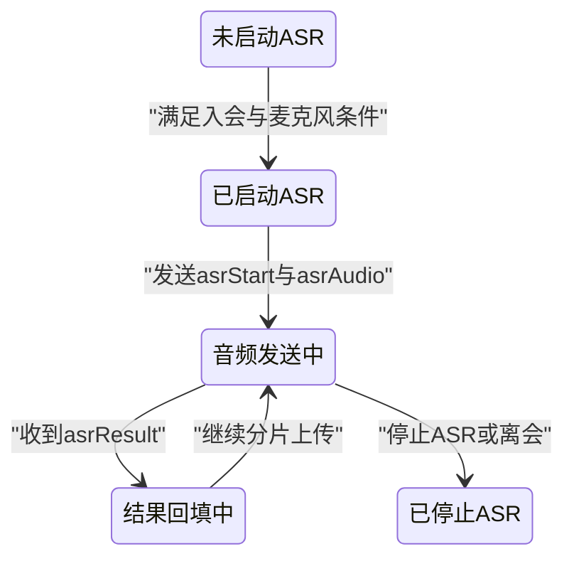
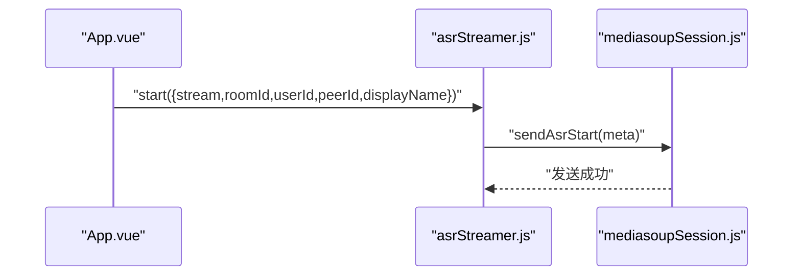
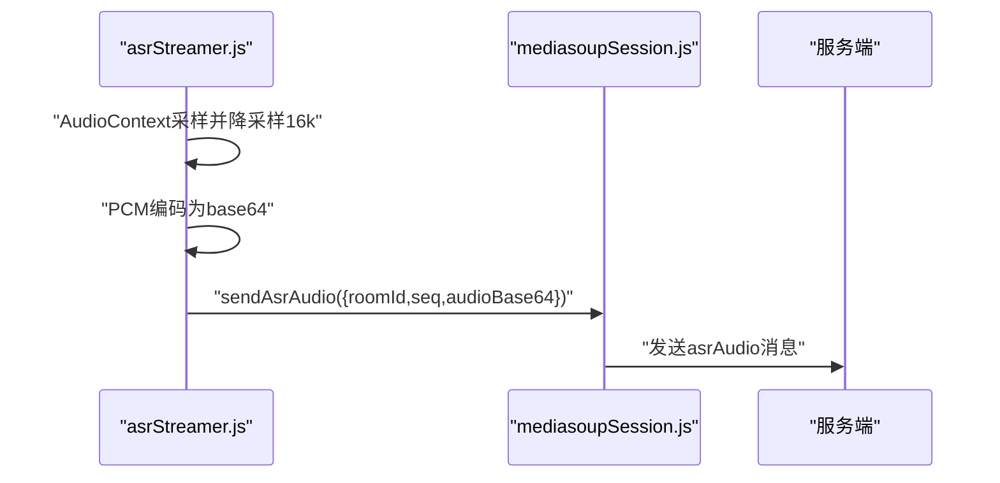
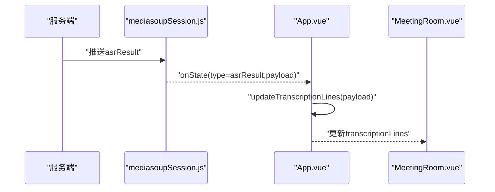
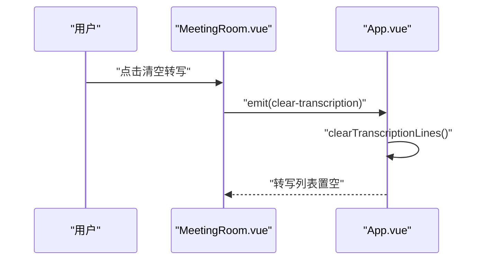
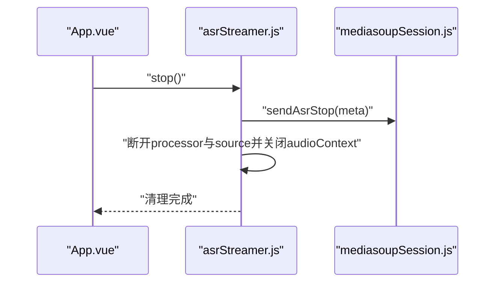
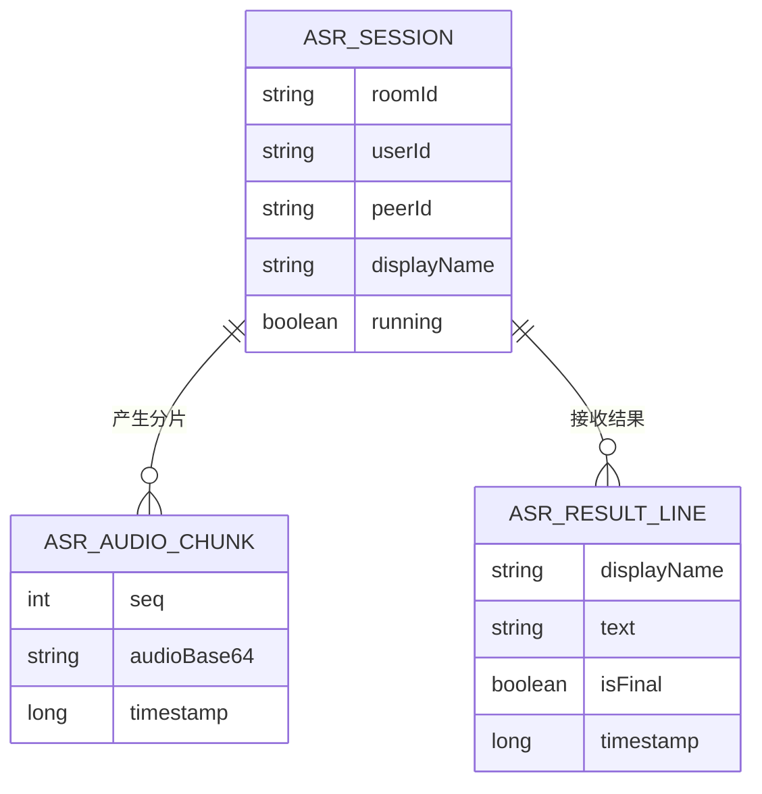

# ASR实时转写 模块分析

## 1. 功能概述 (Functional Overview)
该模块负责会议语音的实时转写：从本地麦克风采集音频、降采样编码、分片上行到信令通道、接收识别结果并更新右侧转写面板。

## 2. 页面跳转流程 (Page Transition Flow)

## 3. 接口清单 (API List)
| Interface Description | URI | Method | Parameter Description | Code Reference |
| :--- | :--- | :--- | :--- | :--- |
| 启动识别会话 | `type: asrStart` | WS Send | `roomId, userId, peerId, displayName` | `src/services/asrStreamer.js` + `src/services/mediasoupSession.js` |
| 上行音频分片 | `type: asrAudio` | WS Send | `roomId, seq, audioBase64` | `src/services/asrStreamer.js` + `src/services/mediasoupSession.js` |
| 停止识别会话 | `type: asrStop` | WS Send | `roomId, userId, peerId` | `src/services/asrStreamer.js` + `src/services/mediasoupSession.js` |
| 接收识别结果 | `type: asrResult` | WS Receive | `displayName, text, isFinal, timestamp` | `src/services/mediasoupSession.js` + `src/App.vue` |

## 4. 业务逻辑时序图 (All Business Logic)
### 4.1 启动ASR

### 4.2 音频分片上传

### 4.3 识别结果回填

### 4.4 清空转写

### 4.5 停止ASR

## 5. 数据模型 (ER Diagram)

