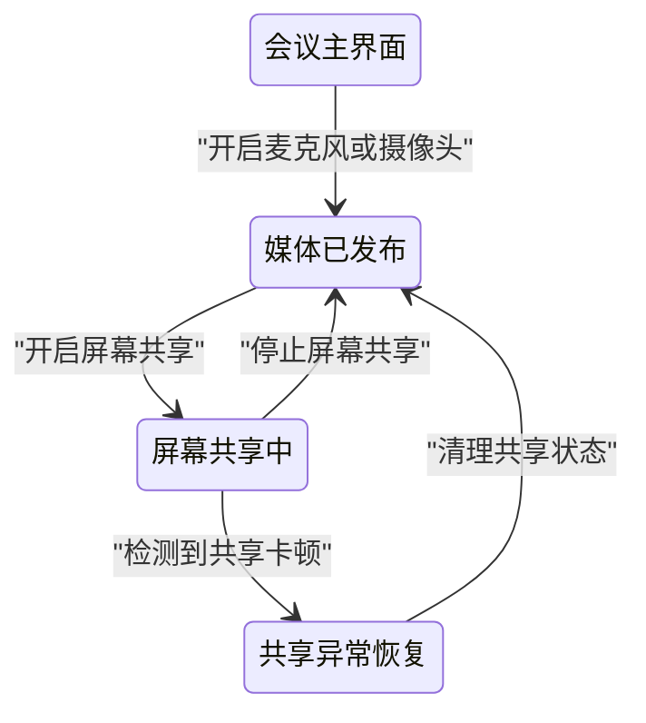
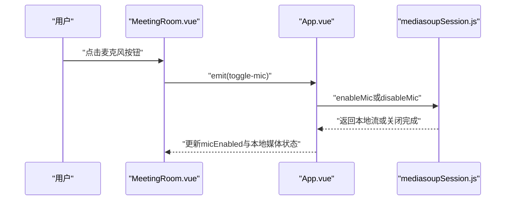
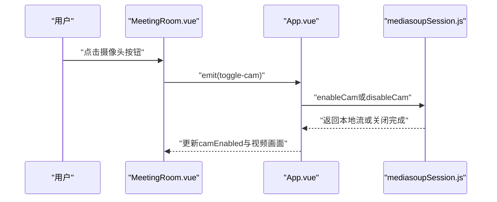
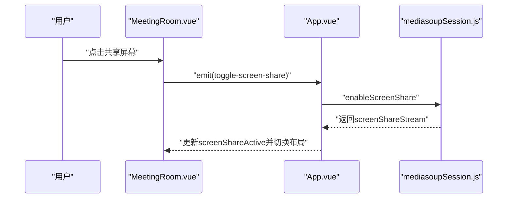
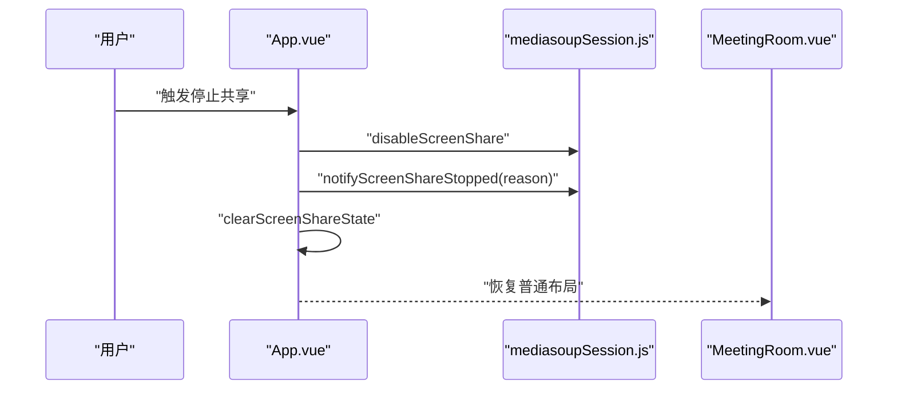
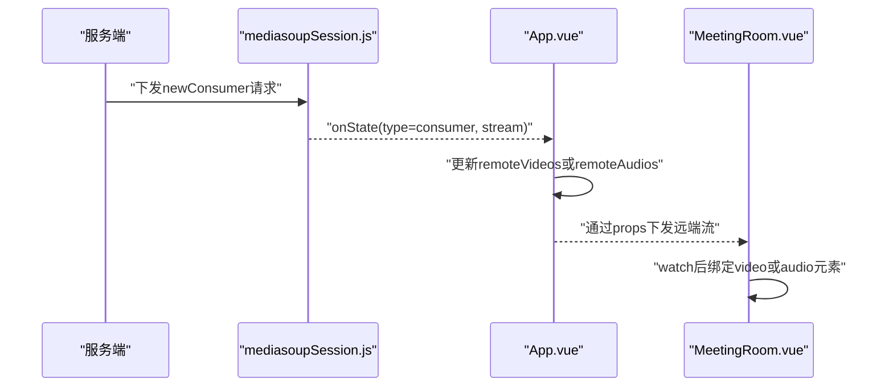
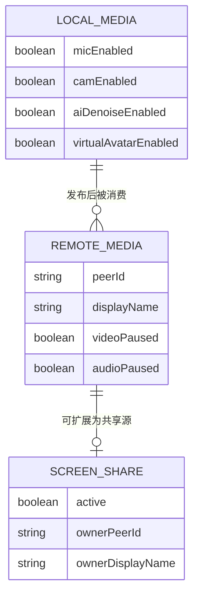

# 会议内音视频与屏幕共享 模块分析

## 1. 功能概述 (Functional Overview)
该模块负责会议中的媒体控制与展示：本地麦克风/摄像头开关、远端音视频消费展示、屏幕共享开始与停止、共享异常检测恢复、参会者媒体状态联动。

## 2. 页面跳转流程 (Page Transition Flow)

## 3. 接口清单 (API List)
| Interface Description | URI | Method | Parameter Description | Code Reference |
| :--- | :--- | :--- | :--- | :--- |
| 发布音频/视频轨道 | `protooRequest:produce` | WS Request | `transportId, kind, rtpParameters, appData` | `src/services/mediasoupSession.js` |
| 广播房间媒体状态 | `type: roomMedia` | WS Send | `kind, enabled` | `src/services/mediasoupSession.js` |
| 广播共享结束 | `type: screenShareStopped` | WS Send | `reason` | `src/services/mediasoupSession.js` |
| 接收新消费者 | `protooServerRequest:newConsumer` | WS Receive | `peerId, producerId, kind, rtpParameters, appData` | `src/services/mediasoupSession.js` |

## 4. 业务逻辑时序图 (All Business Logic)
### 4.1 开关麦克风

### 4.2 开关摄像头

### 4.3 屏幕共享开始

### 4.4 屏幕共享停止

### 4.5 远端流消费并渲染

## 5. 数据模型 (ER Diagram)

