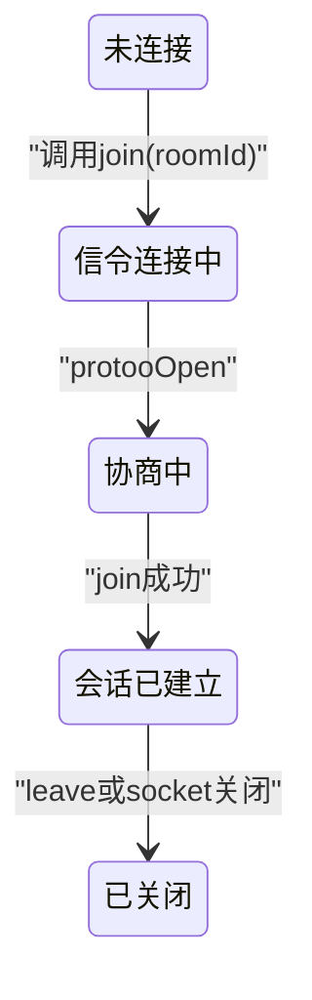
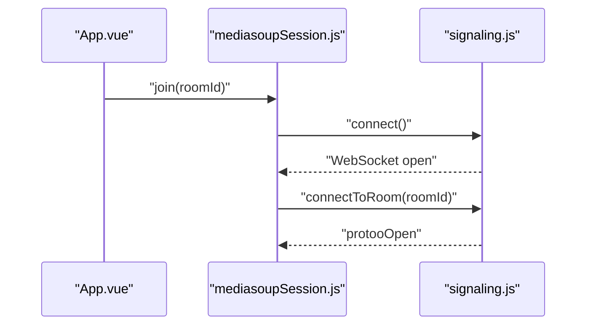
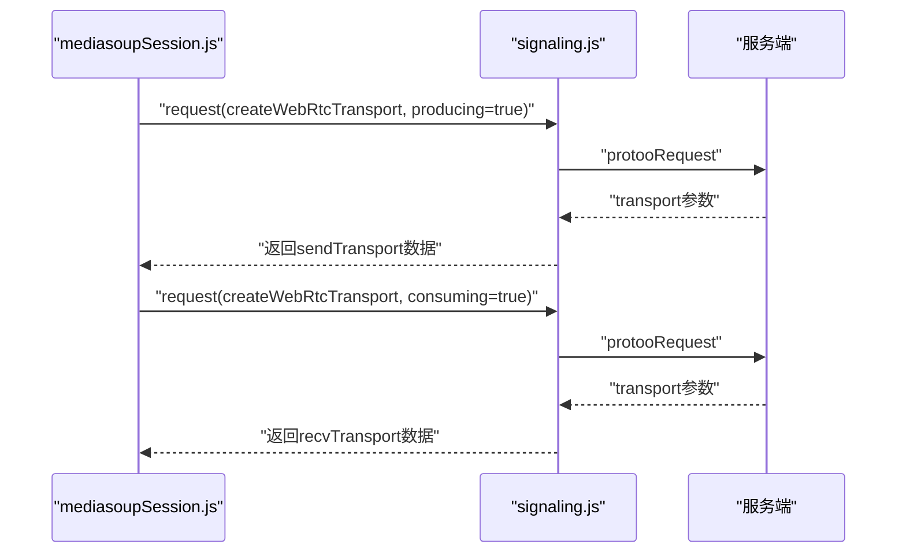
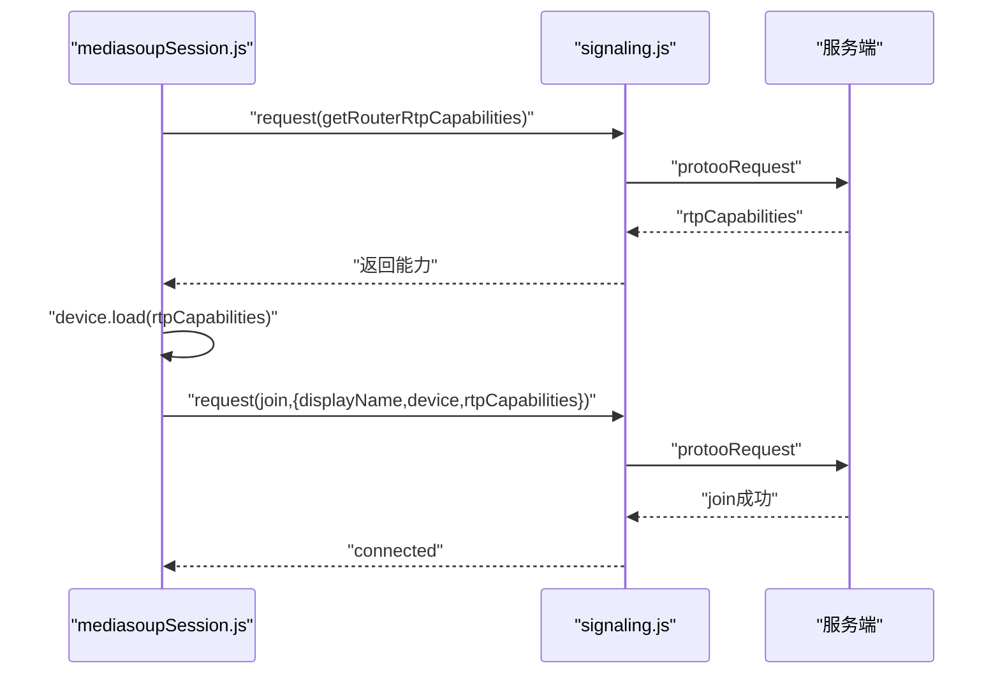
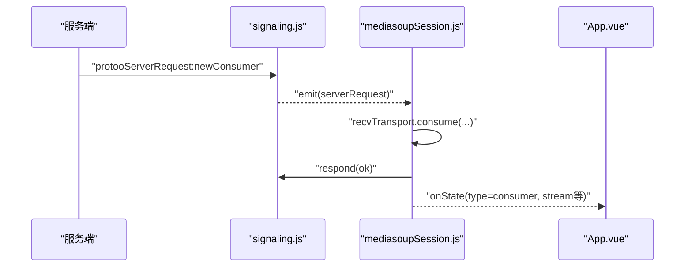
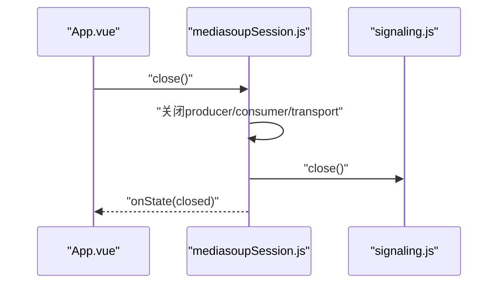
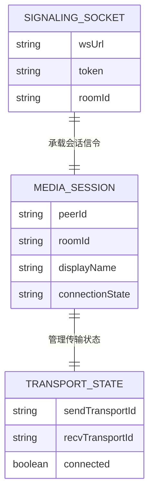

# 信令与媒体会话 模块分析

## 1. 功能概述 (Functional Overview)
该模块负责 WebSocket 信令连接与 mediasoup 会话协商，完成 join、transport 建立、producer/consumer 生命周期管理，并将房间事件统一回调到 `App.vue`。

## 2. 页面跳转流程 (Page Transition Flow)

## 3. 接口清单 (API List)
| Interface Description | URI | Method | Parameter Description | Code Reference |
| :--- | :--- | :--- | :--- | :--- |
| 获取路由能力 | `protooRequest:getRouterRtpCapabilities` | WS Request | 无 | `src/services/mediasoupSession.js` |
| 创建WebRTC传输 | `protooRequest:createWebRtcTransport` | WS Request | `producing, consuming` | `src/services/mediasoupSession.js` |
| 连接传输 | `protooRequest:connectWebRtcTransport` | WS Request | `transportId, dtlsParameters` | `src/services/mediasoupSession.js` |
| 入会 | `protooRequest:join` | WS Request | `displayName, device, rtpCapabilities` | `src/services/mediasoupSession.js` |
| 发布轨道 | `protooRequest:produce` | WS Request | `transportId, kind, rtpParameters, appData` | `src/services/mediasoupSession.js` |

## 4. 业务逻辑时序图 (All Business Logic)
### 4.1 建立信令连接

### 4.2 创建发送与接收Transport

### 4.3 入会协商

### 4.4 处理服务端下发新消费者

### 4.5 会话关闭

## 5. 数据模型 (ER Diagram)

