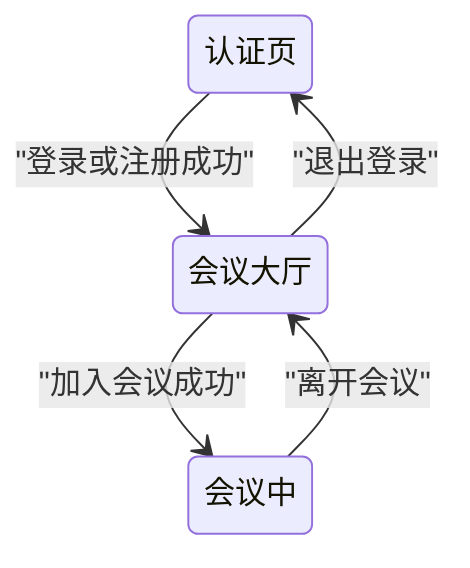
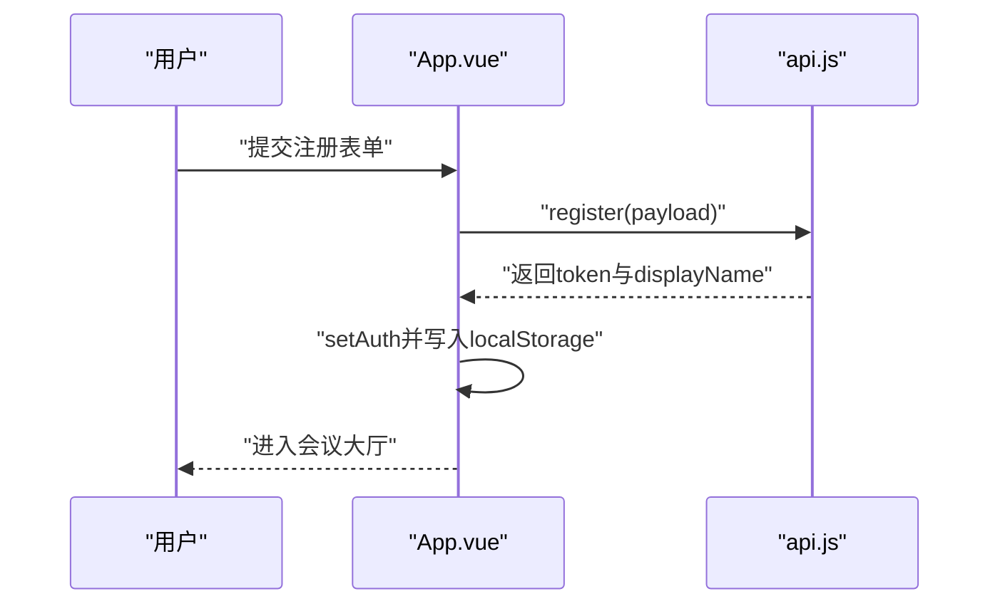
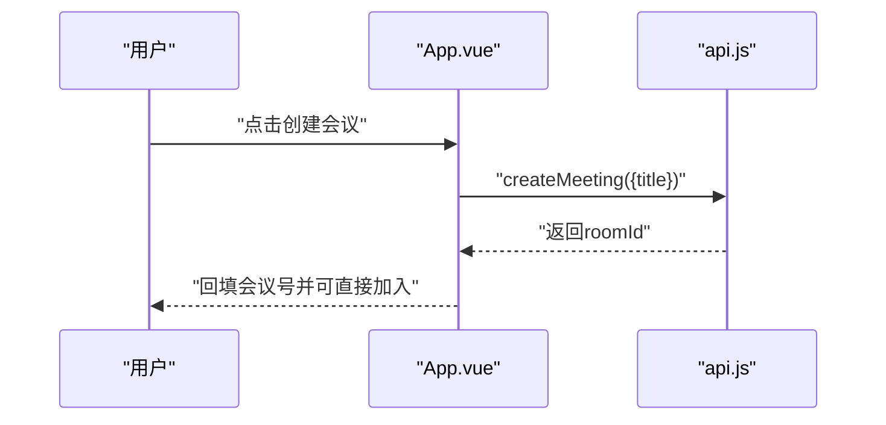
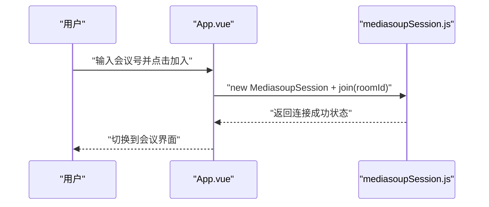
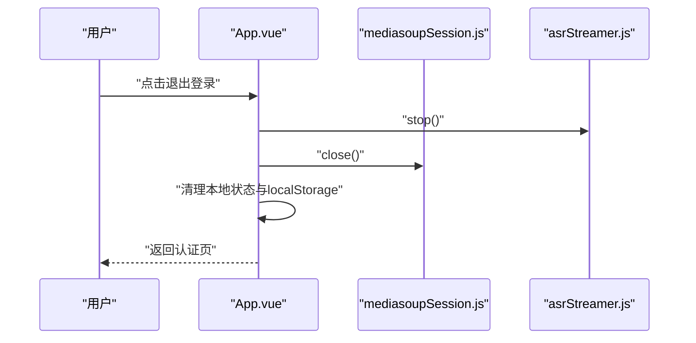
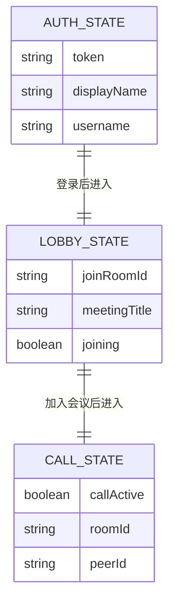

# 认证与会议入口 模块分析

## 1. 功能概述 (Functional Overview)
该模块负责用户身份建立与会议入口控制，覆盖登录、注册、创建会议、输入会议号加入会议、退出登录，并驱动页面在“认证页/大厅页/会议页”之间切换。

## 2. 页面跳转流程 (Page Transition Flow)

## 3. 接口清单 (API List)
| Interface Description | URI | Method | Parameter Description | Code Reference |
| :--- | :--- | :--- | :--- | :--- |
| 用户注册 | `/api/auth/register` | POST | `username, password, displayName` | `src/services/api.js` |
| 用户登录 | `/api/auth/login` | POST | `username, password` | `src/services/api.js` |
| 创建会议 | `/api/meetings` | POST | `title` | `src/services/api.js` |

## 4. 业务逻辑时序图 (All Business Logic)
### 4.1 登录

### 4.2 注册

### 4.3 创建会议

### 4.4 加入会议

### 4.5 退出登录

## 5. 数据模型 (ER Diagram)

