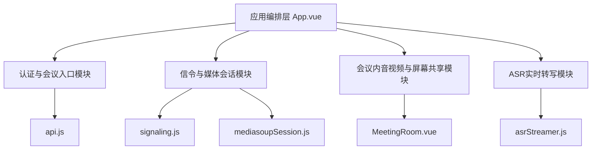
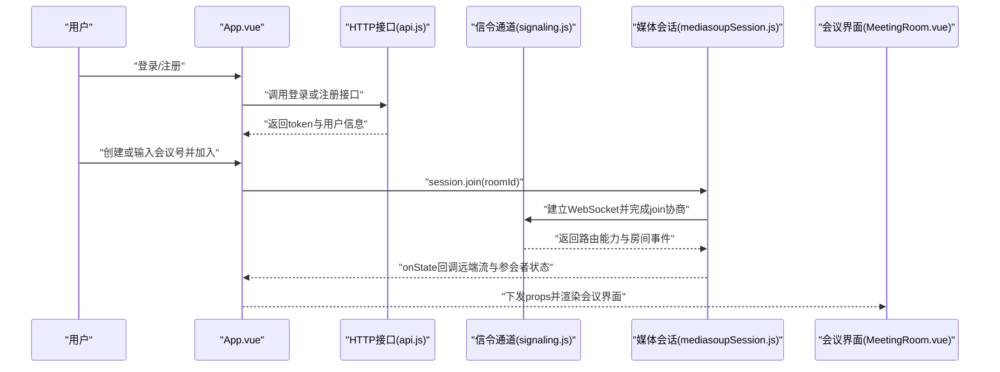

# mediasoup-ui 项目架构总览

## 1. 技术栈概览
- 前端框架：`Vue 3`（SFC + Composition API）
- 构建工具：`Vite`
- 实时媒体：`mediasoup-client`
- 网络通信：`axios`（HTTP） + `WebSocket`（信令）
- 音频处理：`WebAudio` + `@jitsi/rnnoise-wasm`
- 关键入口：`src/main.js` -> `src/App.vue`

## 2. 目录结构
```text
mediasoup-ui/
├─ src/
│  ├─ App.vue
│  ├─ components/
│  │  └─ MeetingRoom.vue
│  ├─ services/
│  │  ├─ api.js
│  │  ├─ signaling.js
│  │  ├─ mediasoupSession.js
│  │  └─ asrStreamer.js
│  ├─ utils/
│  │  └─ device.js
│  ├─ config.js
│  └─ main.js
├─ vite.config.js
└─ package.json
```

## 3. 功能模块划分
1. 认证与会议入口模块
   - 子功能：登录、注册、创建会议、加入会议、退出登录
2. 信令与媒体会话模块
   - 子功能：WebSocket连接、protoo请求响应、join流程、transport建立、房间事件分发
3. 会议内音视频与屏幕共享模块
   - 子功能：开关麦克风、开关摄像头、远端流消费、屏幕共享开始/停止、共享异常恢复
4. ASR实时转写模块
   - 子功能：ASR会话启动、音频分片上行、转写结果回填、转写清空与停止

## 4. 功能模块结构图


## 5. 全局运行流程


## 6. 关键代码参考
- `src/App.vue`
- `src/components/MeetingRoom.vue`
- `src/services/api.js`
- `src/services/signaling.js`
- `src/services/mediasoupSession.js`
- `src/services/asrStreamer.js`
- `src/config.js`
